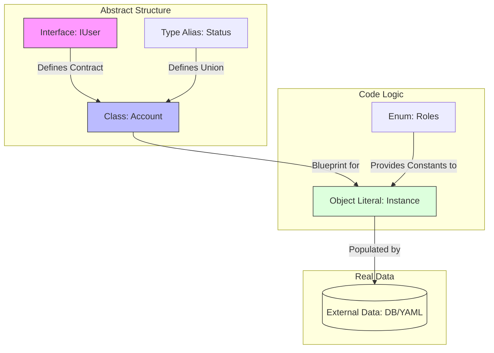

# Four principles of class

# Object
can be anything
Come with **Property** and **Method**

## Abstraction
to simplify reality, focus only the data and processes. 

## Encapsulation
Properties and Methods are bound together and complexity are hidden.

## Inheritance
A class can interit properties and methods from another class. base class and super class. 

## Polymorphism
Different sub-classs from the same super class can implement their shared methods in their own ways. 

| Concept | Purpose | Contains Data? | Runtime Exists? | Extendable / Inheritable | Can Be Used as Type | Supports Logic (functions) | Typical Use Case |
| :--- | :--- | :--- | :--- | :--- | :--- | :--- | :--- |
| **Interface** | Defines the shape / contract of an object | ❌ No | ❌ No | ✅ Yes (extends) | ✅ Yes | ❌ No (only signatures) | Describing object or class structure |
| **Class** | Blueprint for creating instances (objects) | ✅ Yes (via new) | ✅ Yes | ✅ Yes (extends) | ✅ Yes | ✅ Yes | When logic + structure are needed |
| **Type Alias** | Defines a type by name (union, intersection, object, etc.) | ❌ No | ❌ No | ⚠️ Limited (& intersection only) | ✅ Yes | ❌ No | Custom complex or union types |
| **Enum** | Defines a set of named constant values | ✅ Yes | ✅ Yes | ⚠️ No true inheritance | ✅ Yes | ❌ No | Fixed categories (roles, states) |
| **Object Literal** | Actual data / value | ✅ Yes | ✅ Yes | ❌ No | ⚠️ Can infer type | ✅ Yes (methods) | Real data instances (config, constants) |





```javascript
// 1. THE CONTRACT (Developer defined)
interface AppConfig {
  environment: string;
  maxUsers: number;
  roles: string[]; // We use an array because DB data is dynamic
}

// 2. THE DATA (Loaded from YAML/JSON/DB at runtime)
// This is an Object Literal acting as a "Source of Truth"
const rawConfigFromDB = {
  "env": "production",
  "limit": 500,
  "available_roles": ["admin", "editor", "viewer"]
};

// 3. THE SYNTHESIS (Mapping the external data to our logic)
const currentConfig: AppConfig = {
  environment: rawConfigFromDB.env,
  maxUsers: rawConfigFromDB.limit,
  roles: rawConfigFromDB.available_roles
};

console.log(`System running in ${currentConfig.environment}`);
```